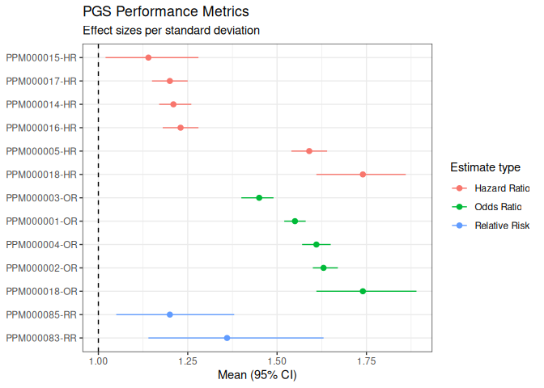
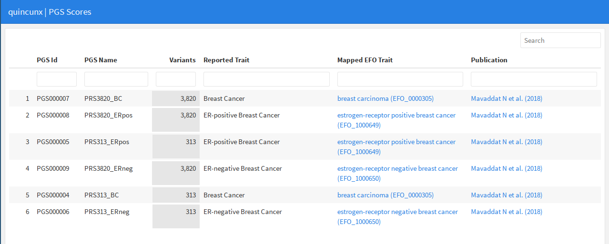

<!-- README.md is generated from README.Rmd. Please edit that file -->

# hapiviz 

<!-- badges: start -->
<!-- badges: end -->

This package provides functions for easy visualisation of data retrieved
with the REST API clients that comprise the hapiverse:
[gwasrapidd](https://github.com/ramiromagno/gwasrapidd) and
[quincunx](https://github.com/maialab/quincunx).

## Installation

``` r
# install.packages("remotes")
remotes::install_github("maialab/hapiviz")
```

## Examples

### Forest plot

Making a forest plot of performance metrics effect sizes:

``` r
library(quincunx)
library(hapiviz)

ppms <- get_performance_metrics(sprintf('PPM%06d', c(1:5, 14:18, 83, 85)))
forest_plot(ppms@pgs_effect_sizes)
```



### Summary report for scores objects

Creating a summarising report for a `scores` object with
`quincunx_pgs_report()`:

``` r
library(quincunx)
library(hapiviz)

# Get the polygenic scores associated with pubmed id 30554720
mavaddat_scores <- get_scores(pubmed_id = '30554720')

# This will show a html table of scores in the Viewer pane of RStudio.
# Use the `file` argument if you want to save the output to an html file.
quincunx_pgs_report(mavaddat_scores)
```


